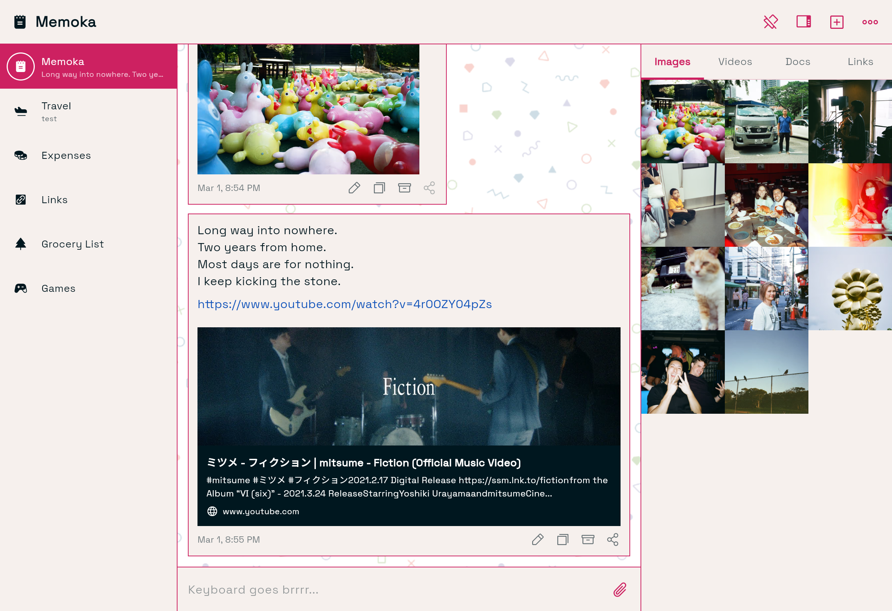

#  memoka

memoka is a stream of consciousness note-taking application.



> This application is built with the assistance of AI generated code as part of an experiment. You can read more about this on [carrein-blog](https://catallenya.com).

# Overview

memoka aims to replicate Telegram's [Saved Message](https://telegram.org/blog/new-saved-messages-and-9-more) experience. Saved Message is a personal space for every Telegram user, making it useful for making notes. memoka copies and augments this functionality with new features.

# Features

- Live notes through WebSocket streaming.
- Channel based notes organization.
- Automatic link previews.
- Media uploads (image, video, document) with async processing.
- GIF search and send via Klipy API.
- Audio playback for uploaded audio files.
- Archival system with configurable retention auto-purge.
- Offline mode with local-first reads and sync-on-reconnect.
- Contextual action menu and multi-select.
- Cross-platform (web, Android) support.
- Markdown formatting.

# Documentation

- [Project Overview](docs/Overview.md)
- [Channel Management](docs/Channel.md)
- [Link Previews](docs/components/Preview.md)
- [Media Uploads](docs/Media.md)
- [Design System](docs/DesignSystem.md)
- [Deployment Guide](docs/Deployment.md)
- **[Security Documentation](docs/Security.md)** - Read before deployment

# Quick Start

## Prerequisites

- Dart SDK 3.10+
- Flutter 3.41+
- Docker & Docker Compose
- PostgreSQL client (optional, for manual DB access)

## Development Setup

1. **Start database services**:

   ```bash
   cd memoka_server
   docker compose up --build --detach
   ```

2. **Install dependencies**:

   ```bash
   # Server
   cd memoka_server
   dart pub get

   # Flutter
   cd ../memoka_flutter
   flutter pub get
   ```

3. **Set up secrets** (IMPORTANT!):

   ```bash
   cd memoka_server/config
   cp passwords.yaml.template passwords.yaml
   # Edit passwords.yaml with strong random values
   # NEVER commit passwords.yaml!
   ```

4. **Run database migrations**:

   ```bash
   cd memoka_server
   dart bin/main.dart --apply-migrations
   ```

5. **Start the server**:

   ```bash
   dart bin/main.dart
   ```

6. **Run Flutter app** (in a new terminal):
   ```bash
   cd memoka_flutter
   flutter run -d chrome
   ```

# Security

This application has NO authentication by design (single-user environment).

**Before deploying publicly or sharing with others:**

1. Read [docs/Security.md](docs/Security.md) - Full security documentation
2. Rotate all secrets in `passwords.yaml`
3. Add authentication (see docs/Security.md)
4. Configure CORS for production domain
5. Enable HTTPS
6. Set up firewall rules

# Architecture

Built with [Serverpod](https://serverpod.dev) v3.3.1:

- **memoka_server**: Backend with real-time streaming, media uploads, link previews
- **memoka_client**: Auto-generated type-safe API client
- **memoka_flutter**: Cross-platform Flutter app (Web/Mobile)

Key technologies:

- PostgreSQL with pgvector
- Redis for real-time messaging
- Riverpod for state management
- Markdown rendering
- Image processing with EXIF handling

See [CLAUDE.md](CLAUDE.md) for detailed architecture and development workflow.

# Deployment

See [docs/Deployment.md](docs/Deployment.md) for the full deployment guide, including Docker setup, GitHub Actions CI/CD, and hosting configuration.
